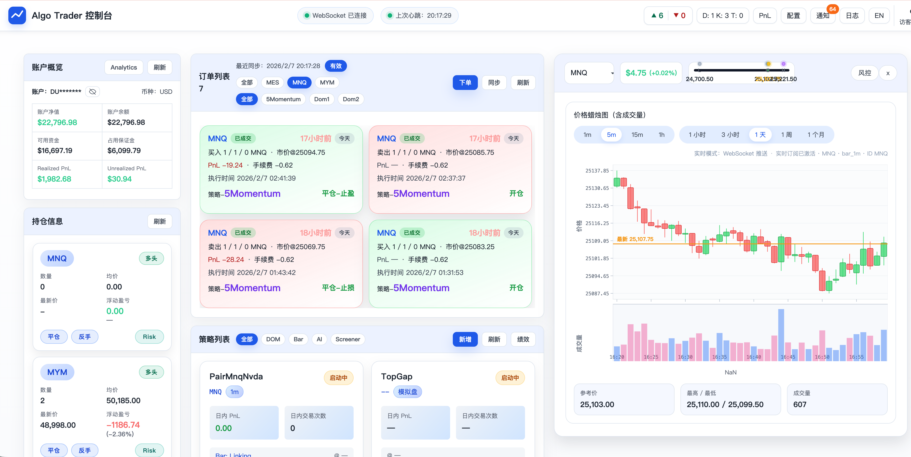
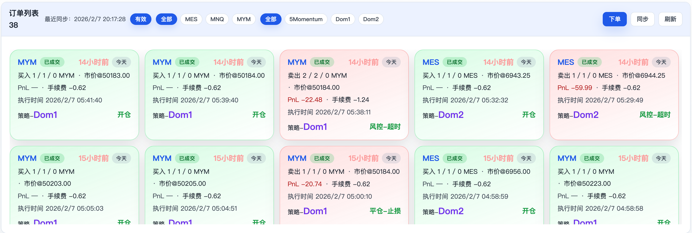
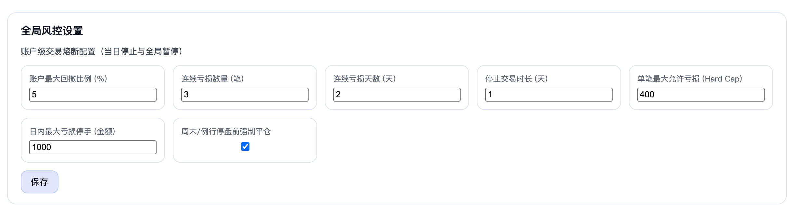
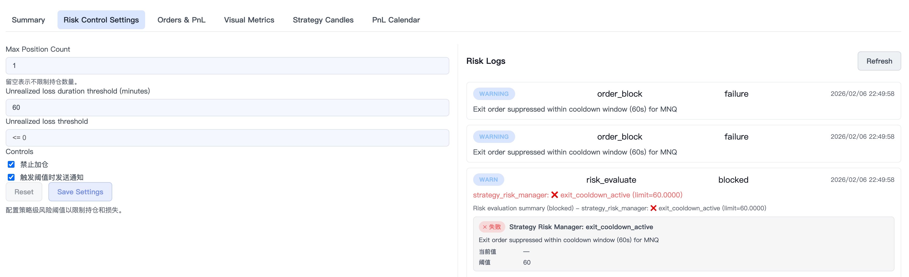
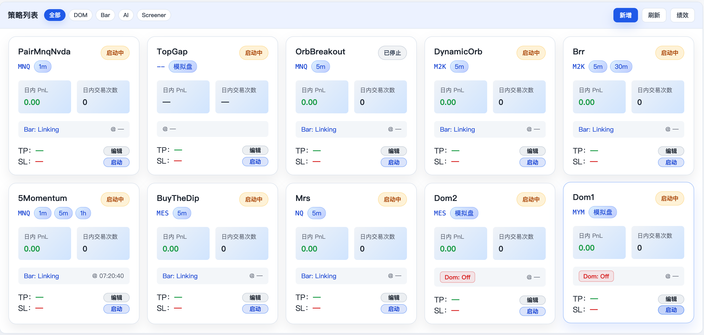
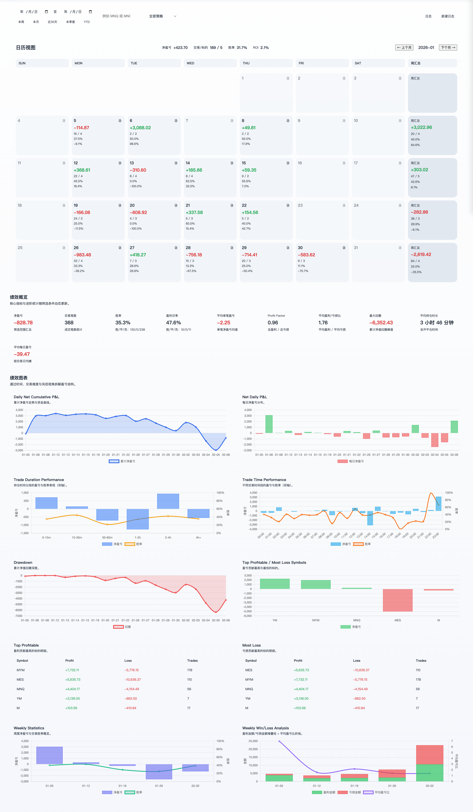

# Algo Trader for IB 主程序前端

本目录包含主程序前端单页应用（SPA），采用 React + TypeScript + Vite 构建，已完成仪表盘、订单、风控、策略、日志、系统设置、文档聚合、新闻与模型运维等页面。

## 功能概览

- 登录与会话守卫，支持匿名访问开关。
- 仪表盘：账户概览、持仓、订单、风控规则、策略运行、通知与行情监控。
- 订单管理：筛选、分页、批量撤单、下单与详情查看，实时刷新订单状态。
- 风控中心：风险指标、规则列表、事件流展示与规则编辑。
- 策略中心：策略列表与详情、运行指标/绩效、分类筛选、创建编辑与启停。
- PnL 日历：统计卡片、收益曲线、交易日历与交易日志维护。
- 日志中心：按级别/时间/关键字筛选，支持自动刷新。
- 系统设置：主程序信息与下游服务状态监控。

## 界面预览








## 运行方式（本地）

```bash
cd frontend
npm install
npm run dev
```

开发服务器默认运行在 `http://localhost:5173`。未显式配置 `VITE_API_BASE_URL` 时，前端默认使用页面同源地址发起请求。

可通过以下方式覆盖后端地址（同时支持 `VITE_WS_URL`）：

1. **`.env` 文件**：在 `frontend/` 下复制 `.env.example` 为 `.env`：

   ```bash
   cp .env.example .env
   ```

2. **命令行环境变量**：

   ```bash
   VITE_API_BASE_URL="https://api.example.com" VITE_WS_URL="wss://api.example.com/ws" npm run dev
   ```

3. **开发代理目标（可选）**：本地请求代理默认指向 `http://localhost:8000`，可用 `VITE_DEV_PROXY_TARGET` 临时覆盖：

   ```bash
   VITE_DEV_PROXY_TARGET="http://localhost:8000" npm run dev
   ```

## 部署方式

### 本地静态部署

```bash
cd frontend
npm install
npm run build
```

构建产物在 `frontend/dist/`，可使用任意静态服务器托管。

### Cloudflare Pages

- 项目根目录：`frontend`
- 构建命令：`npm run build`
- 输出目录：`dist`
- 环境变量：配置 `VITE_API_BASE_URL` 与 `VITE_WS_URL`（使用 HTTPS/WSS 地址）
- SPA 路由：在 Pages 设置中开启单页应用回退到 `/index.html`

## 常用脚本

- `npm run dev`：启动开发服务器。
- `npm run build`：执行 TypeScript 编译并产出生产构建。
- `npm run preview`：预览生产构建结果。
- `npm run lint`：运行 ESLint。
- `npm run check`：串行执行 `lint` 与 `build`。
